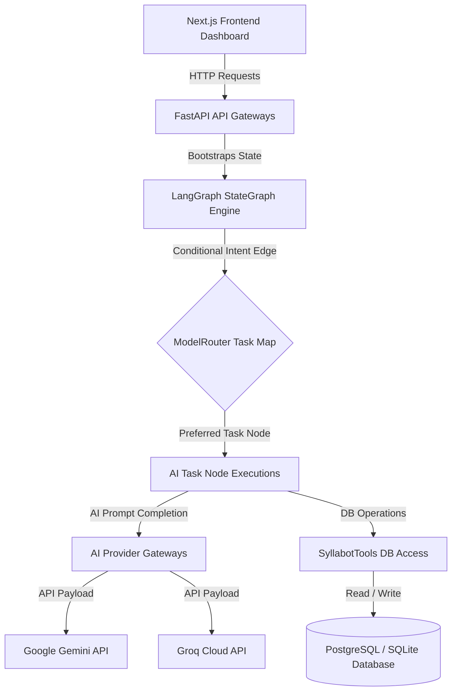
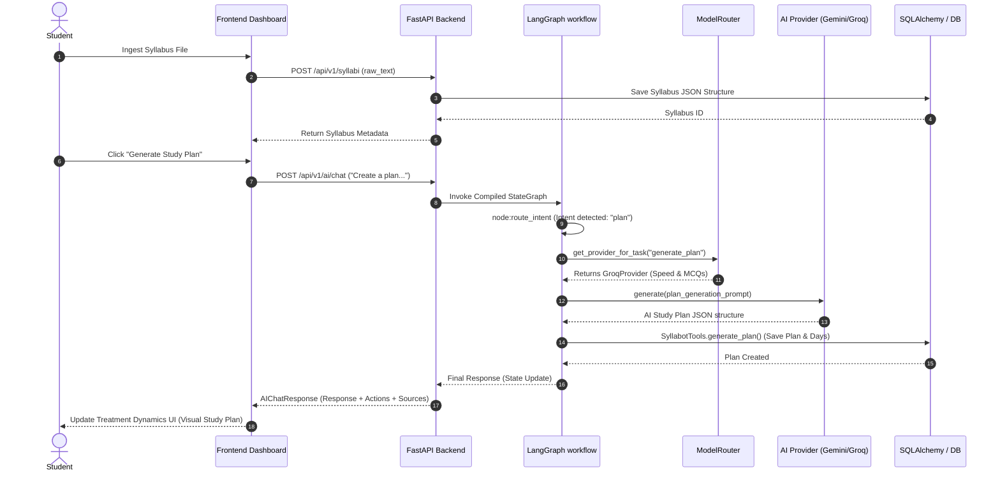
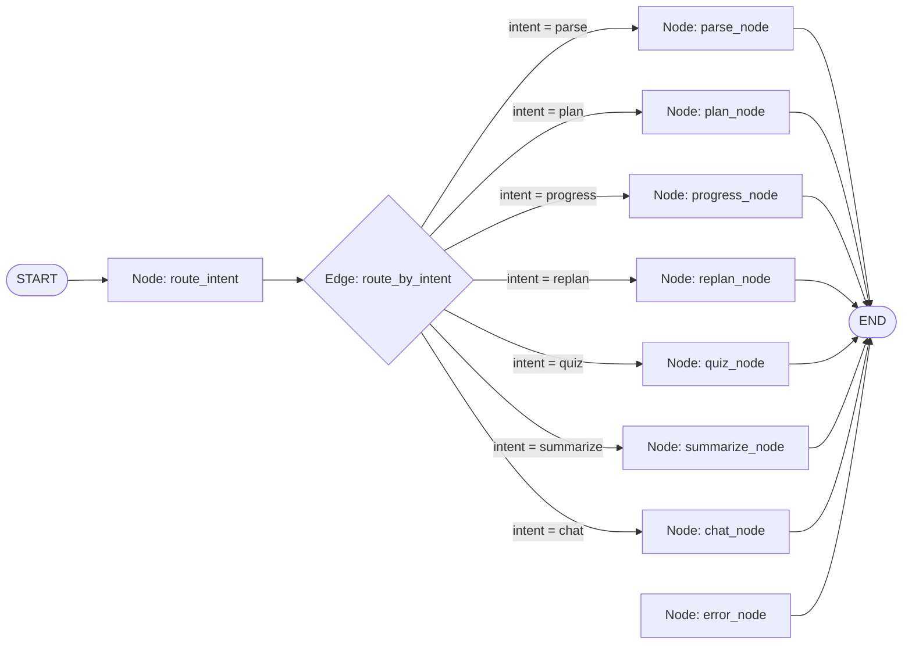

# System Architecture: Syllabot v2

This document describes the end-to-end architecture, routing flows, and component interactions of the **Syllabot Agentic AI Study Planning Platform**.

---

## 1. High-Level Flow Diagram

The diagram below maps the interaction between the frontend dashboard, the FastAPI backend controllers, the LangGraph state machine workflow, and the AI model providers (Gemini & Groq).

---

## 2. Sequence Diagram: Intake & Study Plan Generation

The sequence diagram below details the end-to-end lifecycle when a user submits a syllabus and generates a personalized study plan.

---

## 3. LangGraph Workflow Routing Topology

The AI Orchestrator uses a stateful directed acyclic graph built via LangGraph's `StateGraph`. 

---

## 4. Component Details & Database Flows

### 4.1 Database Layer (SQLAlchemy / Alembic)
- **Database Connection pooling**: Leverages SQLAlchemy connection pools to allow high-throughput PostgreSQL queries in production, with fallback to file-based SQLite databases for local environments.
- **JSON Column mapping**: Uses native SQLAlchemy `JSON` types for syllabus parse trees and study schedules, guaranteeing seamless compatibility between SQLite's text-based JSON mapping and PostgreSQL's native `JSONB` binary formats.

### 4.2 Security & Rate Limiting Pipeline
- **Input Sanitizer**: Filters prompt payloads for keywords related to character overrides or command bypasses, mapping raw inputs to safe, sanitized content.
- **SlowAPI Gatekeepers**: Applies global client limits and stricter sub-limits on agent endpoints (such as `POST /api/v1/ai/chat`) to protect AI resources from malicious spamming.
